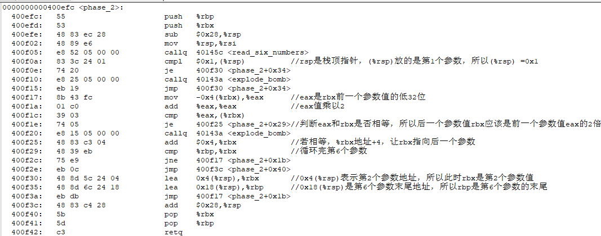
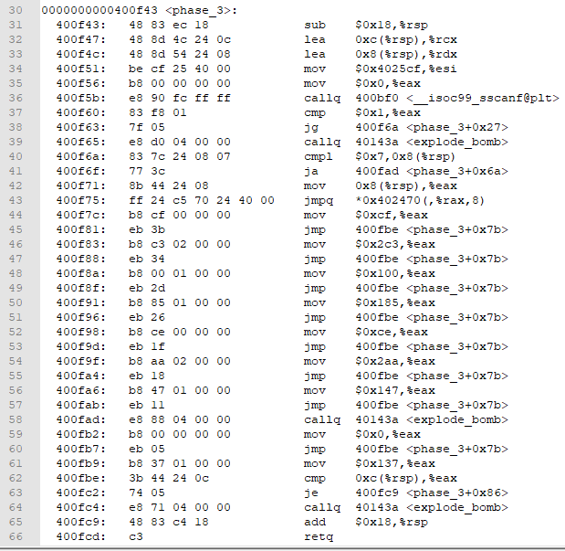

**反编译**：objdump -D bomb > bomb.s

**十六进制显示文件：**xxd bomb > bomb.hex

## phase_1

<strings_not_equal>是判断两字符串是否相等，若相等则eax=0，若不相等则eax=1。即%esi和%rdi的比较。%rdi是我们输入的字符串，%esi是通关字符串。

## phase_2




## phase_3



1. sscanf输入参数

```
<__isoc99_sscanf@plt>的原型：
extern int sscanf (const char *__restrict __s, const char *__restrict __format, ...) __THROW;
```

%rdi ：phase_3(input)

%rsi：$0x4025cf  ->  "%d %d"

%rdx：0x8(%rsp)  -> 第1个参数a

%rcx：0xc(%rsp)  -> 第2个参数b

2. a的范围

```
eax=sscanf(input,"%d %d",&a,&b)
if(eax > 1){
	if(a>7){
		explode_bomb();
	}else{
		eax = a;
		jump_address = eax*8+0x402470;
	}
}else{
	explode_bomb();
}

```

3. jump_address地址内容

转为大端模式，正好对应44、61、46、48、50、52、54、56

00002470: 7c0f 4000 0000 0000   ->   0000 0000 0040 0f7c 

00002478: b90f 4000 0000 0000   ->   0000 0000 0040 0fb9 

00002480: 830f 4000 0000 0000   ->   0000 0000 0040 0f83 

00002488: 8a0f 4000 0000 0000   ->   0000 0000 0040 0f8a  

00002490: 910f 4000 0000 0000   ->   0000 0000 0040 0f91 

00002498: 980f 4000 0000 0000   ->   0000 0000 0040 0f98

000024a0: 9f0f 4000 0000 0000   ->   0000 0000 0040 0f9f  

000024a8: a60f 4000 0000 0000   ->   0000 0000 0040 0fa6 

4. 根据jump_address地址跳转到不同的分支进行赋值操作，最终都执行到62行

```
（例如跳到44行）
eax = $0xcf;
if(b == eax){
	return;
}else{
	explode_bomb();
}
```

所以答案有多个，要求（00002470+8a）对应的分支的赋值语句的值与b相等。

```
a = 0, b = $0xcf = 207
a = 1, b = $0x137 = 311
a = 2, b = $0x2c3 = 707 
a = 3, b = $0x100 = 256
a = 4, b = $0x185 = 389
a = 5, b = $0xce = 206
a = 6, b = $0x2aa = 682
a = 7, b = $0x147 = 327
```

